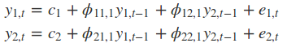

class: left, top

```{r setup, include=FALSE}
options(htmltools.dir.version = FALSE)
```

# Overview

As discussed previously, the key input for this model will be demand growth for transportation to the city.
Accordingly, the model needs to distribute this population into sub-populations separated by transportation method.

---

# Level of detail

The level of detail appropriate for this model can be chosen based on the feasibility of obtaining relevant data. Accordingly, I will be building the model using different transport groups as having distinct populations. These populations transition between transport options conditional on the model's environment.

This promotes deterministic modelling and functional programming.

---

# Growth models

## Logistic growth functions

As each mode of transportation has a maximum capacity ($K$), logistic growth functions are appropriate for describing population movements.

$$ \dfrac{\partial P_i}{\partial t} = r_i\dfrac{(K_i - P_i)}{K_i} P_i $$

---


---

# Transport transition functions

Currently considering functions inspired by VARs or VECMs, as these should introduce change inelasticity for the transportation choices in the population.



---

# Contributory variables

- Weather
- Holidays/events
- Transport disruptions (road closures, rail)

---

# Outcome variables

- Average transportation time
- Stress
- Environmental impact

---


---

# Payoff matrix

Utility of city vs utility of consumers?

Utility of each mode of transportation?

---

# Implementation

The language of choice is R, with necessary functions bundled into an R package, and a UI built on Shiny.


