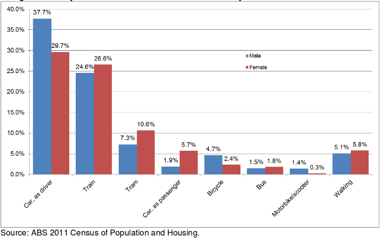

class: left, top

```{r setup, include=FALSE}
options(htmltools.dir.version = FALSE)
```

# Context

Stress on city transportation infrastructure during peak periods is a cause of concern for the many who travel for work.

It is easy to imagine the importance of a well functioning transportation network for a healthy and growing city population.

--

Delays and traffic are detrimental to city health as it:
- Increased worker stress
- Inefficient use of human resources
- Increased environmental impact

---

# Motivation

Models to help understand how city transportation reacts to policy change are essential to support city growth.

This simulation project aims to explore new ways to create **simple and flexible models and tools for modelling consumer choice allocation** problems.

---
class: inverse, center, middle

# Method

---

## Model building

This was chosen on the basis of how **accessible** the data at that level of detail is.
For example, **information about individual's feelings** towards each mode of transportation can be **difficult (or costly) to obtain**.

However information about the **distributions of transportation methods** is expected knowledge for city planners (via sensors, reporting and surveys).

--

Essentially this problem is an allocation problem, where individuals who travel to the city must choose (be allocated to) a mode of transportation. Applying economic theory, the choice the individual makes is subject to their preferences and they will select the option that **maximises their utility**. So how can we approximate a consumer's preferences?

---

## Model dynamics
A model inspired by a **VAR** was built with **logistic growth functions** driving propensities to change.

--

The **VAR** introduces **choice invariance** to the model.

The **growth functions** were selected to provide a representation on **crowding/congestion** for each transportation method, which is a natural modelling approach for environments with carrying capacities.

--

This approach to modelling is **deterministic**, however many elements of the model were built with white noise added to them, representing **unpredictability of consumer choices**.

---


---

## Model dynamics: choice invariance

Consider the AR(1) model:
$$y_t = \phi_1 y_{t-1} + \varepsilon_t, \hspace{2em} \phi_1\in(0,1), \varepsilon_t\sim \mathcal{N}(0, \sigma^2)$$
This model can be used to proxy choice invariance in an allocation model because the next choice allocation is strongly dependent on previous values.

---

## Model dynamics: choice invariance

To extend this to be appropriate for several choices, one can construct a vector auto-regression. 

--

The VAR(1) model is:
\begin{align*}
\mathbf{y}_t &= \boldsymbol{\phi} \mathbf{y}_{t} + \boldsymbol{\varepsilon}_t & \phi_{i,j}&\in(0,1) \forall i,j & \boldsymbol{\varepsilon}_t &\sim \mathcal{N}(\mathbf{0}, \mathbf{I}\sigma^2)
\end{align*}

This allows each choice to depend on previous values of other choices too (lag cross-correlation), and so **propensity to change from one mode of transportation to another** can be modelled. 

--

<br>

Note how many $\phi$ terms need to be estimated, which allows **substantial flexibility** and degrees of freedom in the model.

---

## Model dynamics: Logistic growth functions

As each mode of transportation has a maximum capacity ($K$), logistic growth functions are appropriate for describing population movements.

$$ \dfrac{\partial P_i}{\partial t} = r_i\dfrac{(K_i - P_i)}{K_i} P_i $$

---


---

## Parameterisation approaches

The parameterisation of initial populations were largely **based on reports** from the City of Melbourne<sup>[1]</sup>.
This report projects a 2% growth rate in the city transportation demand, and provides information on network stress.

--

Without the appropriate dataset (that the end-users and stakeholders for this model are assumed to have), correct **estimates for the VAR(1) coefficients and carrying capacities are not available**. If timeseries data on transportation demand by transportation method was available, estimating these coefficients should not be difficult.

.footnote[
[1] [Daily population estimates and forecasts report 2015](https://www.melbourne.vic.gov.au/SiteCollectionDocuments/daily-population-estimates-and-forecasts-report-2015.pdf)
]

---

Approximate proportions of users on each transportation method were drawn from the graph below:


---
class: inverse, center, middle

# Research outcomes

---

.sticker-float[]
<br>

# Implementation:
## Interactive simulation

- ### Designed to be relatable to real-world conditions/scenarios
- ### Flexible specification of inputs

---

## Conclusions

It is difficult to draw conclusions from this simulation which are non-intuitive because very few parameters in the model are data driven. 

--

As a result, the parameterisation is subject to my own bias, and the resulting conclusions are essentially modelled representations of how I expect the city transportation network behaves.

--

However given the appropriate parameterisation, it is interesting to see how setting different growth rates in the carrying capacity for a transportation method effects system demands. The model allows **distinction between public and private transportation** via the autoregressive structure, so for example: when the train capacity rises, the bus demand will decrease as more bus users move to using the rail network.

--

This allows policy makers to tweak growth rates for each transportation network (proxying transportation spending) to determine how different policies would effect overall demand on the system.

---
class: inverse, center, middle

# Project reflection

---

## Model parameterisation

Too many parameters were introduced by the VAR, although it produced an interesting approach to modelling the data.

--

A VAR(1) component would be **better suited** to the problem **if** the model could be **parameterised based on real data**, which was not available for all transport methods publically. Parameterisation of this model requires estimates of the long run behaviour (ignoring growth), which is difficult to approximate without a dataset.

--

With available data, more complex models could be specified and appropriately paramaterised. These data driven models could handle shifts in economic conditions, temperature, satisfaction surveys, etc.

--

Another issue was with differences in scale between transportation methods. A correlation from one mode of transportation to another is dependent on the scale. So for example, bikes will always be at their carrying capacity due to small autoregressions with larger transportation methods (say trains). In reality, an appropriate parameterisation for this value would be far smaller, and on the scale of the bicycle capacity.

---

.sticker-float[]
<br>

# Implementation using R & Shiny

--

Shiny was well suited for building the UI for this project.

The new modular UI support made it possible to allow so many parameterisation inputs to the model.

It also **significantly simplified** building the UI inputs themselves, and passing values between the server and the UI.

--

A big challenge with this project was handling of many inputs, and using R and **functional programming** approaches (via `purrr`) with **non-standard evaluation** (`rlang`) made the model implementation much simpler.

---

# Extensions / Further work

--

Factors such as **transportation time** and **cost** are not adequately incorporated in this model and can be improved.

--

<br>

For example, when the road or rail network is below a certain proportion of capacity, no further time benefits will be realised if even less individuals use that transportation method. 

Having a minimum effective capacity in addition to a maximum carrying capacity would be a better way to approximate time.

---

# Extensions / Further work

Cost could also provide an interesting dimension to the model by approximating individual's isocost curves. Some individuals or transportation method populations may be more sensitive to changes in cost. 

This is approximated by the off-diagonal terms in the VAR coefficients, however it isn't perfect.

--

<br>

Other commonly observed patterns with transportation demand, such as multiple seasonal patterns for differences in weekdays and weekends would useful. Similarly, the multiplicative effect of extraneous factors for weather and holidays is not ideal.

--

<br>

Finally, the model should have some implementation of capacity sharing. Currently each mode of transportation has its own carrying capacity, but they should also be limited by the capacity of the road network that they share.

---
class: inverse, center, middle

# Questions?
