class: center, top

```{r setup, include=FALSE}
options(htmltools.dir.version = FALSE)
```

.bgquote[.bigtxt[
_Tennis is mostly mental._
]
.medtxt[
_You win or lose the match before you even go out there._
]]

.right[
\- Serena Williams
]

--

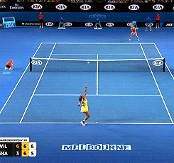

???

# Motivation

## We want to understand emotion to determine how it impacts the play of a game. 

---

# How can we collect emotion data?

--

## Should we ask the players?
    
--

.center[
### Not feasible
]

???

We can't interrupt the match to ask how they're feeling after every point.
  
--

.center[
### Questionable self-reporting accuracy
]

???

Intentional / unintentional self reporting of emotions. Different players may verbalise emotions differently.

--


## Instead, predict their emotion visually

---
class: inverse, center, bottom
background-image: url(img/court.png)
background-size: cover

# Broadcast videos

---


# Commercial services

--

.center[
.logo[

]
]

--

.center[
.logo[

]
]

--

.center[
.logo[

]
]

---


# Face detection

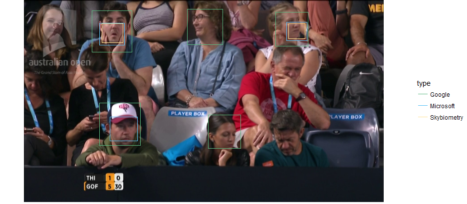

???

easy, has been used to focus cameras and count populations for many years.

---

# Emotion detection


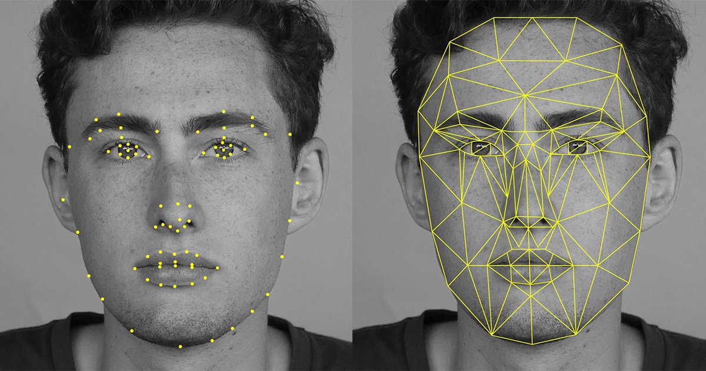

???

Much more difficult, more recent development

Facial landmarks are used to produce a mesh that describes facial features, such as a raised eyebrow or open mouth.
These positions can be passed into a NN to predict emotions.

---
class: inverse, center, top

# How do we define emotion via expression?

--

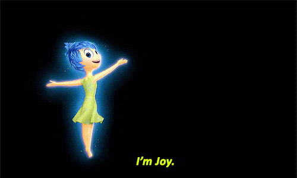

???

Paul Ekman is a psychologist who is a pioneer in the study of emotions and their relation to facial expressions.
He helped Pixar develop the characters for Inside Out! :)

---
class: center, middle

# Sample emotion classifications

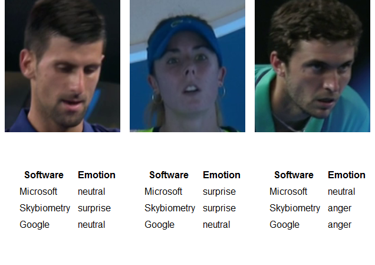

---
class: inverse, center, top

# Great! 

--

## We've classified emotions from faces!


---
class: inverse, center, top

# But wait...

--

## How accurate are they?

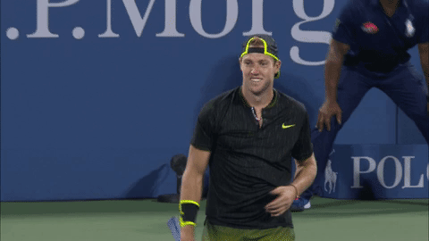

---

# Emotion classification preferences

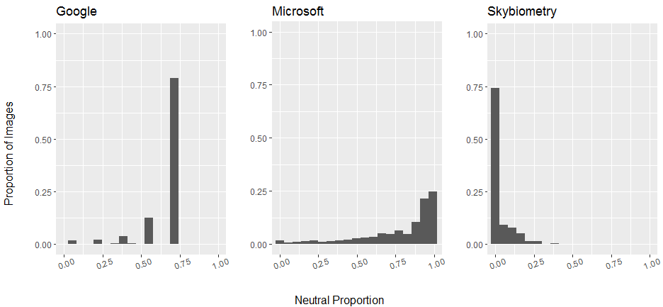

---
class: center

# Individual baseline expressions

--

### Some players usually appear surprised

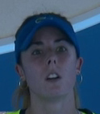


???

Alize Cornet

--

### Others may typically appear angry

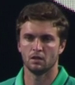


???

Gilles Simon

---
class: center

# Individual baseline expressions

## Players express their emotions in different ways

???

# Consider deviation from average expression

### Key area for improvement is improving robustness to individual expressions


---
# Additional challenges

--

.center[
## Clothing accessories
]

--

.center[
## Face angle to the camera
]

---
class: inverse, center, middle

# Emotions are hard

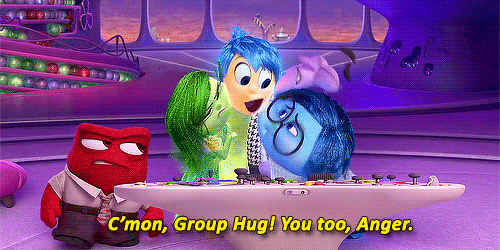

---

### Reliable emotions allow creation of usable timelines of emotion against performance

---
class: inverse, center
background-image: url(img/bg3.png)
background-size: cover

# Questions?

---
class: inverse, center, middle

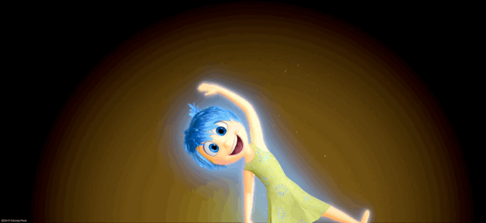