```{r setup, include=FALSE}
options(htmltools.dir.version = FALSE)
knitr::opts_chunk$set(echo = FALSE, message=FALSE, warning = FALSE, cache=TRUE, fig.width = 12)
library(thesis)
library(tidyverse)
library(lubridate)
library(fpp2)

theme_set(theme_gray(base_size = 23))
```

## What is multiple seasonality?

???

My topic area for my honours research project is forecasting multiple seasonality.

Seasonality is a *regular* pattern which repeats over some fixed period of time

Multiple seasonality is two or more of these seasonal patterns.

For example:

--
```{r}
ped_plot <- pedestrian %>%
  filter(Sensor_Name == "Southern Cross Station") %>%
  mutate(workday = ifelse(Day %in% c("Saturday", "Sunday"), "Weekend", "Weekday"),
         TimeOnly = DateTime)
date(ped_plot$TimeOnly) <- Sys.Date() # Condense into single day for overlap
ggplot(ped_plot, aes(x = TimeOnly,
                         y=Hourly_Counts,
                         group=date(DateTime))) +
  geom_line(alpha=0.05) + 
  facet_wrap(~ workday) + 
  ylab("Total pedestrians counted") + 
  xlab("Time") + 
  ggtitle("Seasonality in pedestrian traffic at Southern Cross Station") + 
  scale_x_datetime(date_labels = "%H %p") + 
  theme(axis.text.x = element_text(angle = 90, hjust = 1))
```

???


Two types of seasonality is present:
- Daily seasonality
- Hourly seasonality

They interact as the hourly pattern changes depending on if it is a weekday, or weekend.

This forms a complex pattern to model

---

## What is multiple seasonality?

```{r}
ped_reg_plot <- pedestrian %>%
  filter(Sensor_Name == "Southern Cross Station") %>%
  filter(DateTime > as.Date("2017-3-27") & DateTime < as.Date("2017-4-24")) %>% 
  mutate(series = "Hourly counts")
ped_agg_plot <- ped_reg_plot %>%
  group_by(date(DateTime)) %>%
  summarise(Hourly_Counts = sum(Hourly_Counts), DateTime = median(DateTime)) %>%
  mutate(series = "Daily counts")
ggplot() +
  geom_line(aes(x=DateTime, y=Hourly_Counts), data = ped_agg_plot) + 
  geom_line(aes(x=DateTime, y=Hourly_Counts), data = ped_reg_plot) +
  facet_grid(series~., scales="free_y") + 
  ylab("Pedestrians counted") + 
  xlab("Date") +
  ggtitle("Temporal granularity in pedestrian traffic at Southern Cross Station")
```

???

Systems which were previously observed daily, can now be measured hourly, revealing these patterns of multiple seasonality.

The availability of multiple seasonal time series data is growing rapidly as sensors that are capable of recording more data, more often become commonplace. 


Requiring accurate MSTS modelling is essential for understanding and predicting these complex systems


---
class: inverse, center, middle

# Where is multiple seasonality found?

---
class: inverse, center, top
background-image: url(resources/utility.jpg)
background-size: cover

# Utilities

???

Go through revealing list

---
class: inverse, center, top
background-image: url(resources/traffic.jpg)
background-size: cover

# Transportation

---

class: inverse, center, top
background-image: url(resources/electronics.jpg)
background-size: cover

# Consumer electronics

---

class: inverse, center, top
background-image: url(resources/health.jpg)
background-size: cover

#  Health

---

class: inverse, center, top
background-image: url(resources/everywhere.jpg)
background-size: cover

#  Everywhere!

???

Multiple seasonality is evident in all systems involving humans, as humans have daily routines which vary between weekdays and weekends.

So, which datasets am I using for this research?...


---
class: inverse, center, middle

# Research datasets

???

So, which datasets am I using for this research?...

---
class: inverse, center, bottom

background-image: url(resources/pedestrian.jpeg)
background-size: cover

# Pedestrian counts

???

43 sensor locations located around our city, which have been providing hourly counts of pedestrians since 2009 (almost 2 million observations!)

Valuable for **understanding** and forecasting pedestrian traffic is valuable for **urban planning, event management and business development**

Lots of data allows models to be tested at scale.

---

# Pedestrian counts

```{r}
ped_reg_plot <- pedestrian %>%
  filter(Sensor_Name == "Southern Cross Station") %>%
  filter(DateTime > as.Date("2017-3-27") & DateTime < as.Date("2017-4-24"))
ggplot() +
  geom_line(aes(x=DateTime, y=Hourly_Counts), data = ped_reg_plot) +
  ylab("Pedestrians counted") + 
  xlab("Date") +
  ggtitle("Sub-sample of pedestrian traffic at Southern Cross Station")
```


???

Strong multiple seasonal pattern

Holiday effects (Easter, point to graph)

---
class: inverse, center, top

background-image: url(resources/electricity.jpeg)
background-size: cover

# Electricity demand

???

Half-hourly smart meter electricity demand data from Victoria

---

# Electricity demand

```{r}
elecdemand_plot <- elecdemand %>%
  as.data.frame %>%
  mutate(DateTime = seq(ymd_hms("2014-01-01 00:00:00", tz="ADST"),
                        by=as.difftime(minutes(30)),
                        length.out = NROW(elecdemand)))
elecdemand_plot %>%
  gather("Series", "Value", Demand, Temperature) %>%
  ggplot(aes(x=DateTime, y=Value, group=Series)) +
  geom_line() +
  facet_grid(Series ~ ., scales = "free_y") + 
  ylab("Electricity demanded (GW)") + 
  xlab("Date")
```

???

Driven by the **covariate temperature**

Being able to accurately forecast electricity generation need is beeficial for the **environment**, **costs** and **preventing black-outs**

---

# Multiple seasonal models

### The ideal model is:

???

So what makes a good model for forecasting multiple seasonality time series?

--

.center[
## Accurate
]

???

Pretty self explanatory, model accuracy is highly desirable. Doesn't require any further justification :)

--

.center[
## Flexible
]

???

Model specification should be flexible to suit a wide range of data applications. A tuned specification reduces the parameterisation problem.

--

.center[
## Fast
]

???

The model should produce estimates in a reasonable amount of time

--

.center[
## Robust
]

???

The model should not be sensitive to outliers or noise.

---
class: inverse, center, middle

# Regression models

???

I think it's safe to assume a basic understanding of regression models, so:

Response is a linearly dependent on the regressors, which can be time series variables

Multiple seasonality is achieved by adding seasonal dummy variables or splines

---

# Considered regression models

### Three regression models are considered:

--

.center[
## Multiple Linear Regression
]

???

Simplest form, with additive and interacting seasonal dummy variables

--

.center[
## Generalised Additive Models
]

???

Which is a generalisation that does not restrict the response as being normally distributed.
Seasonality implemented additively using interacting splines

--

.center[
## Prophet
]

???

A specification of a GAM model recently open-sourced by a Facebook research team.
Seasonality is approximated using a exponential form Fourier series.

---

## Regression model findings

???

Read from slides

--

.pull-left[## Strengths:
- ### Highly flexible specification
- ### Co-variates (and holidays) easily included
- ### Relatively fast]

--

.pull-right[## Weaknesses:
- ### Doesn't naturally handle serial correlation
- ### Time series components cannot evolve over time]

---
class: inverse, center, middle

# State space models

???

A model where the observed response variable is supplemented by unobserved auxiliary state variables. These state variables summarise the history of the observed, and are used to determine future behaviour of the data

The state variables evolve over time in accordance to a recurrance relationship.

---

# Considered state space models

### Three state space models are considered:

--

.center[
## Double-seasonal Holt-Winters
]

???

Simplest form, adds two seasonal terms to the model which evolve over time

--

.center[
## BATS/TBATS
]

???

BATS is an extension of DSHW which includes a Box-Cox transformation, ARMA errors, and unlimited seasonal terms.
TBATS extends BATS by also reformulating the seasonality with a trigonometric Fourier series.

--

.center[
## Multiple seasonal ARIMA
]

???

Implements multiple seasonality by combining seasonal autoregression.
Unlike DSHW, BATS and TBATS, this can handle coregressors.

---

## State space model findings

???

Read from slides

These are more or less the opposite of the regression models.

--

.pull-left[## Strengths:
- ### Time series components evolve over time
- ### Naturally handles serial correlation]

--

.pull-right[## Weaknesses:
- ### Inflexible model specification
- ### Co-variates (and holidays) are difficult to include
- ### Relatively slow]

---
class: inverse, center, middle

# Research plan and preliminary results

---

# Evaluate currently used models

???

Fortunately, there's plenty of data! Perhaps too much data!

As lots of data makes it difficult to fully test the models using the typical cross-validation techniques.

--

- ## Model accuracy
    K-fold rolling-origin time series cross-validation method

???

K-fold rolling-origin time series cross-validation. This reduces the computation necessary by orders of 100s.

Most forecasts are considerably poor, however more analysis is required.

Currently multiple seasonal ARIMA seems to perform the best, however the optimal specification for the regression methods is yet to be determined

--

- ## Computation speed

???

Record estimation computation time whilst testing accuracy.

State space models seem substantially slower than regression models.

--

- ## Robustness
    Introduce noise and outliers by simulation

???

Plan to test model sensitivity by introduce noise and outliers by simulation

---

# Proposed model

--

### A structural state space model, with:

--

- ### Multiple sources of error (to allow exogenous inputs)

--

- ### Flexible specification of model terms (especially for seasonality)

--

- ### Substantially reduced parameterisation problem

--

- ### Which hopefully makes it reasonably fast

---

# Implementation

--


???

Everything is done in R using RStudio with a variety of packages

---

# Implementation


???

knitr and rmarkdown have been used to generate the proposal and presentation

---

# Implementation


???

lubridate manages the dates

---

# Implementation


???

ggplot for graphs

---

# Implementation


???

These for data manipulation and functional programming

---

# Implementation


???

devtools to maintain the package

---

# (and many more packages without stickers)

## Especially noteworthy:

- ### forecast by Rob Hyndman
- ### dlm by Giovanni Petris

???

forecast package provides many of the tools for comparing the considered models
(where is our R sticker Rob?)

dlm package is where our proposed model will be constructed

---

# Reproducible research

???

This results and findings in this project aim to be reproducible

--

- ### All data is freely available in public domain

???

Read from slides

--

- ### Research progress and history maintained in a Git repository

--

- ### All data, code and packages necessary are bundled into an R package

---
class: inverse, center, top

# Questions?

--

# Comments?

--

# Suggestions?

---

# Seasonal growth
```{r}
ped_reg_trend_plot <- pedestrian %>%
  filter(Sensor_Name == "Southern Cross Station") %>%
  mutate(workday = ifelse(Day %in% c("Saturday", "Sunday"), "Weekend", "Weekday")) %>%
  group_by(workday, date(DateTime)) %>%
  summarise(Minimum = min(Hourly_Counts), Maximum = max(Hourly_Counts), DateTime = median(DateTime)) %>%
  gather(Value, Hourly_Counts, Minimum, Maximum)
ggplot() +
  geom_line(aes(x=DateTime, y=Hourly_Counts, colour=Value), data = ped_reg_trend_plot) + 
  facet_grid(workday ~ ., scale="free_y") +
  ylab("Pedestrians counted") + 
  xlab("Date")
```

???

Note that when the seasonality is aggregated out of the time series, you can observe an "additive trend"

However when observed sub-daily, this trend is not additive. Instead, the spread of the seasonality increases. The minimum observations remains constant.

---
class: center

## K-fold rolling-origin time series cross-validation 
```{r, fig.height=4}
par(mar=c(0,0,0,0))
plot(0,0,xlim=c(0,28),ylim=c(0,1),
       xaxt="n",yaxt="n",bty="n",xlab="",ylab="",type="n")
k <- 3
i <- 1:k
for(j in 1:7)
{
  test <- (3+j*k):26
  train <- 1:(5+j*k)
  arrows(0,1-j/7,27,1-j/7,0.05)
  points(train,rep(1-j/7,length(train)),pch=19,col="blue")
  if(length(test) >= min(i)){
    points(test[i], rep(1-j/7, k), pch=19, col="red")
    points(test[-i], rep(1-j/7,max(0,length(test)-k)), pch=19, col="gray")
  }
  else
    points(test, rep(1-j/7,length(test)), pch=19, col="gray")
}
text(28,1-1/7,"time")
```

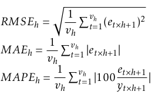

---

# RMSE from algorithm for snaive

```{r}
pedestrian_ts_all <- pedestrian %>% 
  filter(Sensor_Name == "Southern Cross Station") %>%
  group_by(Sensor_Name) %>%
  filter(DateTime > max(DateTime) - years(2)) %>%
  ungroup() %>%
  split(.$Sensor_Name)
msts_pedestrian_ts_all <- pedestrian_ts_all %>%
  map(~ msts(.$Hourly_Counts, seasonal.periods = c(24, 24*7)))
snaive_errors <- msts_pedestrian_ts_all %>%
  map(~ kstep_tsCV(., snaive, k=7*24*3) %>%
        as.data.frame) %>%
  bind_rows(.id = "Sensor_Name") %>%
  gather(h,e,-Sensor_Name) %>%
  group_by(h, Sensor_Name) %>%
  summarise(RMSE = sqrt(mean(e^2, na.rm=TRUE)),
            MAE = mean(abs(e), na.rm=TRUE)) %>%
  ungroup() %>%
  mutate(h = as.numeric(substr(h, 2, 99)))
snaive_errors %>%
  filter(Sensor_Name == "Southern Cross Station") %>%
  ggplot(aes(x=h, y=RMSE, group=Sensor_Name)) +
  geom_line(alpha=0.2) + 
  geom_smooth(method="lm", se=FALSE)
```

---

# MLR

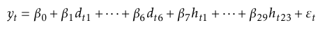


---

# MLR forecast

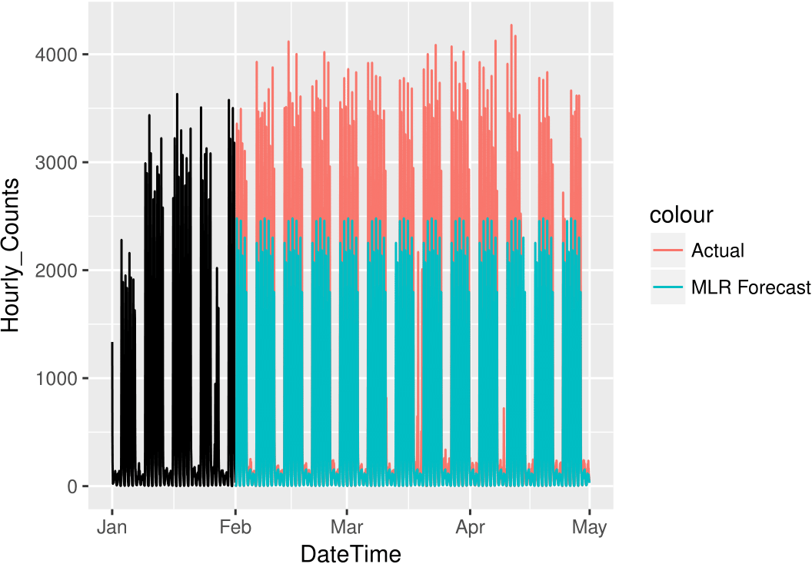

---
# GAM

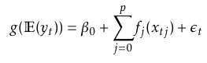

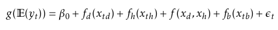

---

# GAM forecast

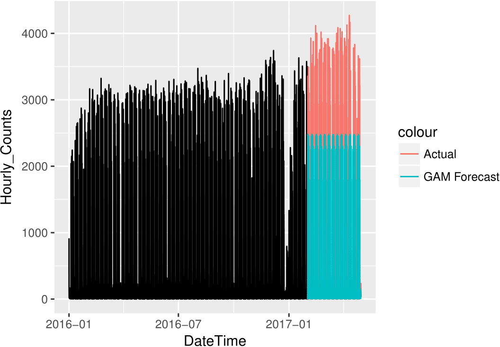

---

# Prophet 

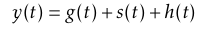

g(t) is defined by either a linear or a logistic growth model

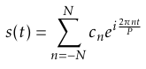

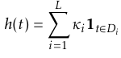

---

# Prophet forecast

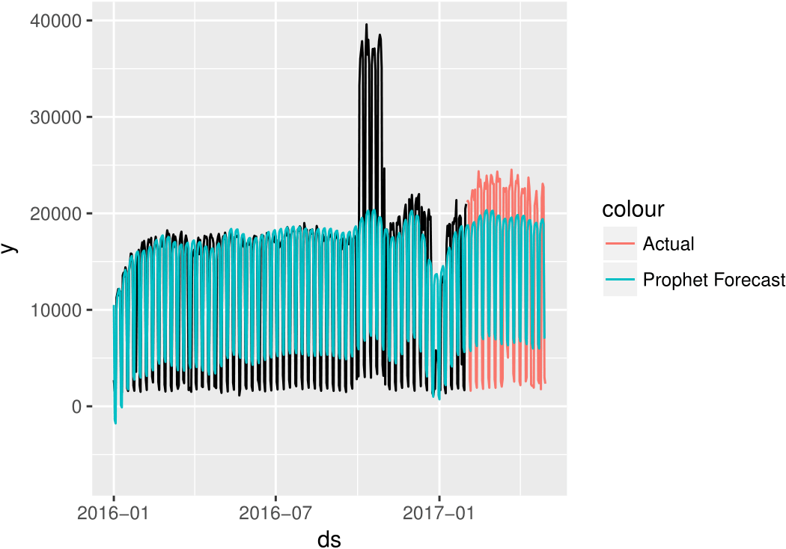

---

# State space models

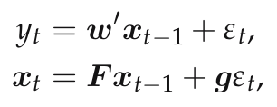

---

# DSHW

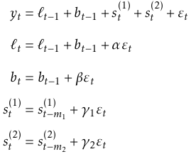

---

# DSHW forecast

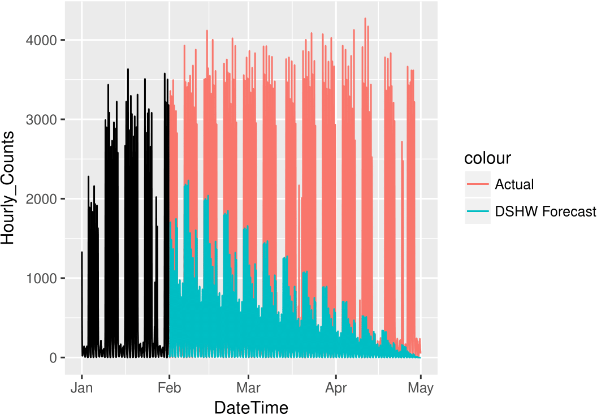

---

.pull-left[# BATS


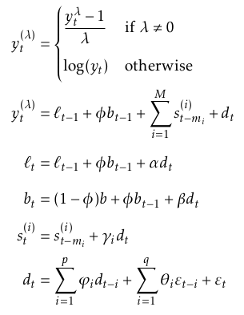]

.pull-right[# TBATS

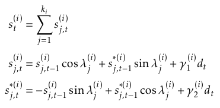]


---

# TBATS forecast

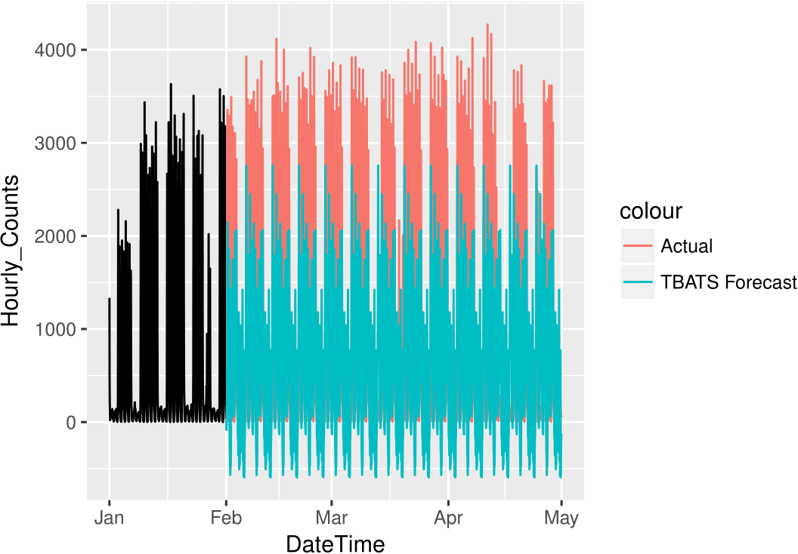

---

# Multiple seasonal ARIMA

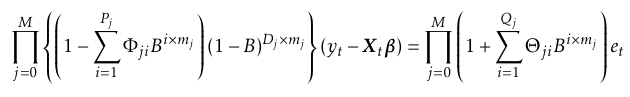
